Caua Lindao Calculator
Este é um simples projeto, feito em Windows Forms com C#, de uma calculadora de operações básicas da matemática.

💻 Demosntração do programa:
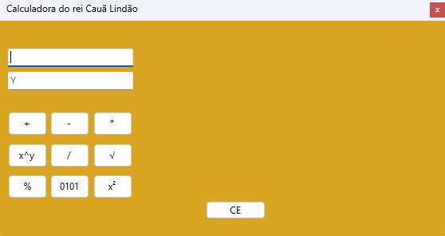

🔵 Funções extras:
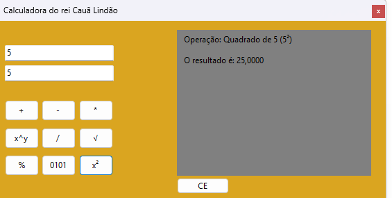
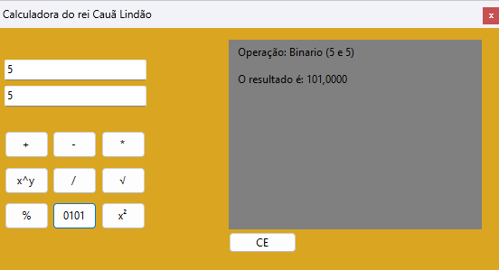
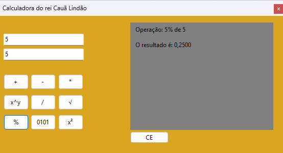
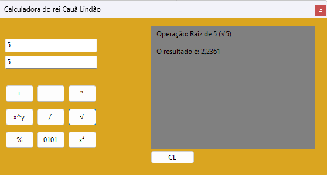
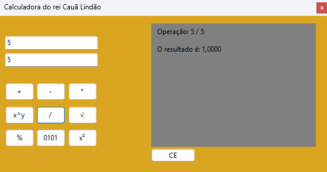
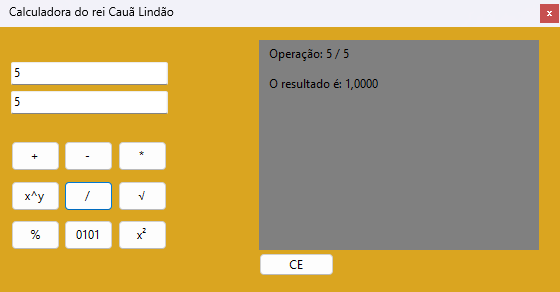
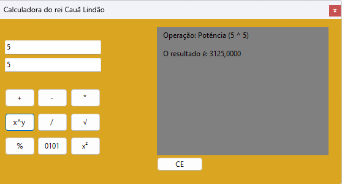
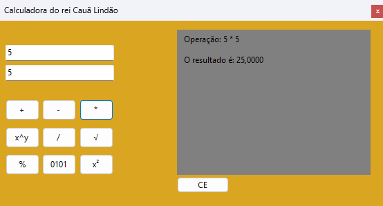
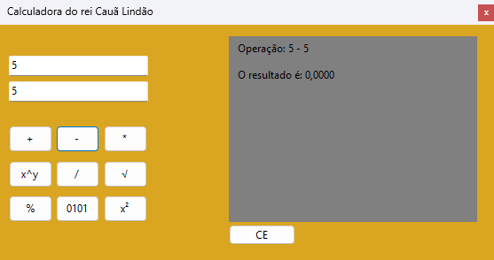
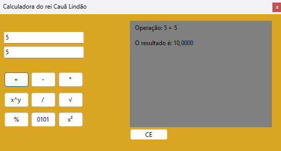

Baixe a versão do programa aqui